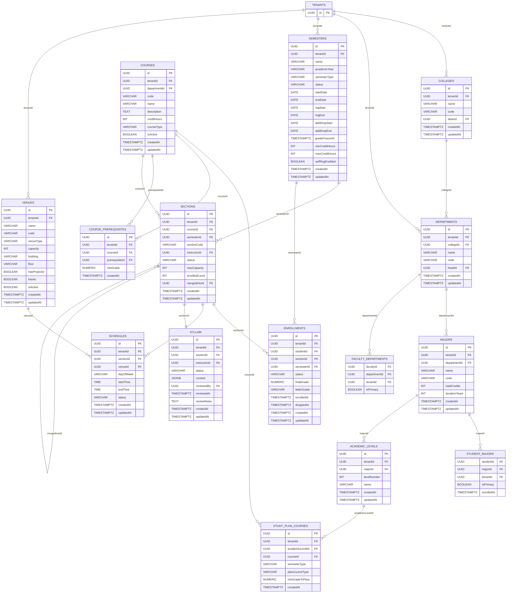
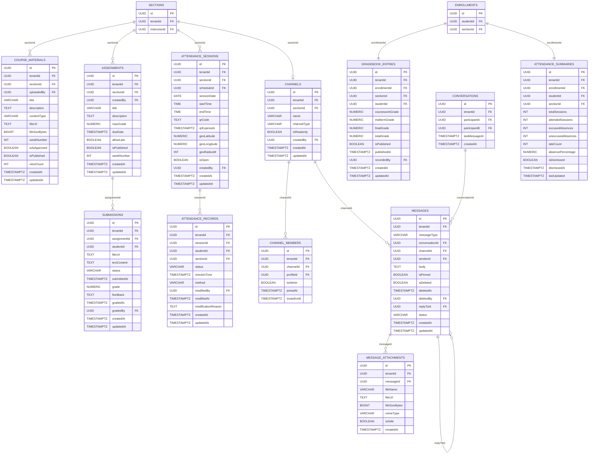
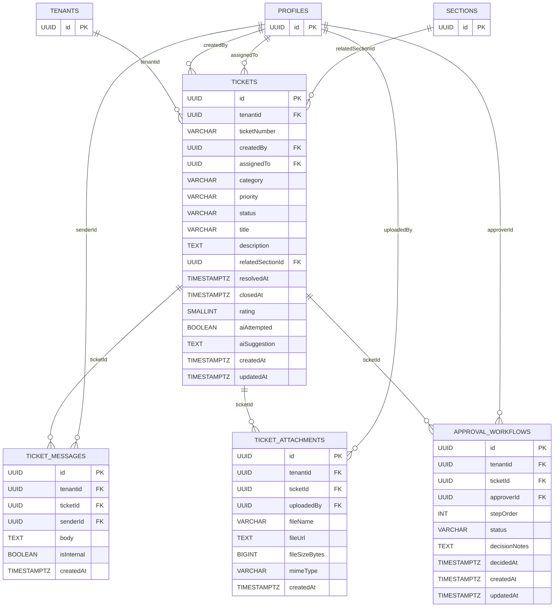
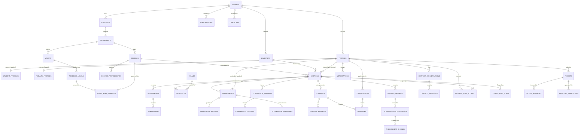

# UniBot Platform — Entity Relationship Diagram
**Deliverable 3 | Mermaid.js ERD**

> Render this diagram using any Mermaid-compatible viewer:
> - VS Code extension: "Mermaid Preview"
> - Online: https://mermaid.live
> - GitHub Markdown (renders natively)

---

> **Note on scale:** The full schema has 52 tables. The ERD is split into
> **5 focused domain diagrams** to remain readable, followed by a
> **master relationship summary**. Each diagram is self-contained and
> valid Mermaid `erDiagram` syntax.

---

## Diagram 1 — Platform & Tenant Management + Identity

```mermaid
erDiagram
    SUBSCRIPTION_PLANS {
        UUID id PK
        VARCHAR name
        TEXT description
        NUMERIC priceMonthly
        INT maxUsers
        INT maxStorageGb
        JSONB features
        BOOLEAN isActive
        TIMESTAMPTZ createdAt
        TIMESTAMPTZ updatedAt
    }

    TENANTS {
        UUID id PK
        VARCHAR name
        VARCHAR subdomain
        VARCHAR customDomain
        TEXT logoUrl
        VARCHAR primaryColor
        VARCHAR secondaryColor
        TEXT welcomeMessage
        VARCHAR defaultLanguage
        VARCHAR timezone
        VARCHAR status
        UUID planId FK
        INT maxUsers
        INT maxStorageGb
        NUMERIC storageUsedGb
        NUMERIC absenceThreshold
        DATE contractStart
        DATE contractEnd
        VARCHAR adminEmail
        TIMESTAMPTZ createdAt
        TIMESTAMPTZ updatedAt
        TIMESTAMPTZ deletedAt
    }

    SUBSCRIPTIONS {
        UUID id PK
        UUID tenantid FK
        UUID planId FK
        VARCHAR status
        DATE startDate
        DATE endDate
        BOOLEAN autoRenew
        TIMESTAMPTZ createdAt
        TIMESTAMPTZ updatedAt
    }

    INVOICES {
        UUID id PK
        UUID tenantid FK
        UUID subscriptionId FK
        NUMERIC amount
        VARCHAR currency
        VARCHAR status
        DATE dueDate
        TIMESTAMPTZ paidAt
        TIMESTAMPTZ createdAt
        TIMESTAMPTZ updatedAt
    }

    SYSTEM_ANNOUNCEMENTS {
        UUID id PK
        VARCHAR title
        TEXT body
        BOOLEAN isActive
        TIMESTAMPTZ createdAt
        TIMESTAMPTZ expiresAt
    }

    PROFILES {
        UUID id PK
        UUID tenantid FK
        VARCHAR role
        VARCHAR firstName
        VARCHAR lastName
        VARCHAR nationalId
        VARCHAR gender
        DATE dateOfBirth
        VARCHAR phone
        TEXT avatarUrl
        VARCHAR accountStatus
        BOOLEAN isDndActive
        TEXT dndMessage
        TIMESTAMPTZ lastLoginAt
        TIMESTAMPTZ createdAt
        TIMESTAMPTZ updatedAt
    }

    CUSTOM_ROLES {
        UUID id PK
        UUID tenantid FK
        VARCHAR name
        TEXT description
        JSONB permissions
        VARCHAR scope
        TIMESTAMPTZ createdAt
        TIMESTAMPTZ updatedAt
    }

    PROFILE_CUSTOM_ROLES {
        UUID profileId FK
        UUID customRoleId FK
        TIMESTAMPTZ assignedAt
        UUID assignedBy FK
    }

    FACULTY_PROFILES {
        UUID profileId PK_FK
        UUID tenantid FK
        VARCHAR employeeId
        JSONB officeHours
        VARCHAR specialization
        TIMESTAMPTZ createdAt
        TIMESTAMPTZ updatedAt
    }

    STUDENT_PROFILES {
        UUID profileId PK_FK
        UUID tenantid FK
        VARCHAR studentNumber
        INT enrollmentYear
        NUMERIC cumulativeGpa
        INT totalCreditHours
        INT earnedCreditHours
        VARCHAR riskLevel
        NUMERIC riskScore
        TIMESTAMPTZ riskUpdatedAt
        TIMESTAMPTZ createdAt
        TIMESTAMPTZ updatedAt
    }

    AUDIT_LOGS {
        BIGINT id PK
        UUID tenantid FK
        UUID actorId FK
        VARCHAR actorRole
        VARCHAR action
        VARCHAR targetTable
        UUID targetId
        JSONB oldData
        JSONB newData
        INET ipAddress
        TEXT userAgent
        TIMESTAMPTZ createdAt
    }

    SUBSCRIPTION_PLANS ||--o{ TENANTS : "plan_id"
    SUBSCRIPTION_PLANS ||--o{ SUBSCRIPTIONS : "plan_id"
    TENANTS ||--o{ SUBSCRIPTIONS : "tenantid"
    TENANTS ||--o{ INVOICES : "tenantid"
    SUBSCRIPTIONS ||--o{ INVOICES : "subscription_id"
    TENANTS ||--o{ PROFILES : "tenantid"
    TENANTS ||--o{ CUSTOM_ROLES : "tenantid"
    PROFILES ||--o{ PROFILE_CUSTOM_ROLES : "profileId"
    CUSTOM_ROLES ||--o{ PROFILE_CUSTOM_ROLES : "custom_role_id"
    PROFILES ||--o| FACULTY_PROFILES : "profileId"
    PROFILES ||--o| STUDENT_PROFILES : "profileId"
    TENANTS ||--o{ AUDIT_LOGS : "tenantid"
    PROFILES ||--o{ AUDIT_LOGS : "actor_id"
```

---

## Diagram 2 — Academic Structure



---

## Diagram 3 — LMS, Attendance & Messaging



---

## Diagram 4 — AI, Analytics & Circulars

```mermaid
erDiagram
    TENANTS {
        UUID id PK
    }

    PROFILES {
        UUID id PK
        UUID tenantid FK
    }

    SECTIONS {
        UUID id PK
        UUID instructorId FK
    }

    COURSE_MATERIALS {
        UUID id PK
        UUID sectionId FK
        BOOLEAN isAiApproved
    }

    CIRCULARS {
        UUID id PK
        UUID tenantid FK
        UUID createdBy FK
        VARCHAR title
        TEXT body
        VARCHAR targetType
        UUID targetId
        BOOLEAN isMandatory
        BOOLEAN isPublished
        TIMESTAMPTZ publishedAt
        TIMESTAMPTZ expiresAt
        TIMESTAMPTZ createdAt
        TIMESTAMPTZ updatedAt
    }

    NOTIFICATIONS {
        UUID id PK
        UUID tenantid FK
        UUID recipientId FK
        VARCHAR notificationType
        VARCHAR title
        TEXT body
        BOOLEAN isRead
        TIMESTAMPTZ readAt
        VARCHAR referenceTable
        UUID referenceId
        TIMESTAMPTZ createdAt
    }

    AI_KNOWLEDGE_DOCUMENTS {
        UUID id PK
        UUID tenantid FK
        UUID sectionId FK
        UUID materialId FK
        UUID uploadedBy FK
        VARCHAR title
        VARCHAR docType
        TEXT fileUrl
        BOOLEAN isActive
        INT totalChunks
        TIMESTAMPTZ createdAt
        TIMESTAMPTZ updatedAt
    }

    AI_DOCUMENT_CHUNKS {
        UUID id PK
        UUID tenantid FK
        UUID documentId FK
        INT chunkIndex
        TEXT content
        INT pageNumber
        INT timestampSec
        VECTOR_1536 embedding
        INT tokenCount
        TIMESTAMPTZ createdAt
    }

    CHATBOT_CONVERSATIONS {
        UUID id PK
        UUID tenantid FK
        UUID userId FK
        VARCHAR sessionId
        BOOLEAN isActive
        TIMESTAMPTZ createdAt
        TIMESTAMPTZ endedAt
    }

    CHATBOT_MESSAGES {
        UUID id PK
        UUID tenantid FK
        UUID conversationId FK
        VARCHAR role
        TEXT content
        UUID_ARRAY sourceChunkIds
        INT tokenUsage
        TIMESTAMPTZ createdAt
    }

    STUDENT_RECOMMENDATIONS {
        UUID id PK
        UUID tenantid FK
        UUID studentId FK
        UUID sectionId FK
        UUID sentBy FK
        VARCHAR title
        TEXT body
        TEXT materialUrl
        BOOLEAN isRead
        TIMESTAMPTZ createdAt
    }

    AI_TOKEN_USAGE {
        BIGINT id PK
        UUID tenantid FK
        UUID userId FK
        VARCHAR model
        INT promptTokens
        INT completionTokens
        INT totalTokens
        NUMERIC costUsd
        TIMESTAMPTZ createdAt
    }

    STUDENT_RISK_SCORES {
        UUID id PK
        UUID tenantid FK
        UUID studentId FK
        UUID sectionId FK
        UUID semesterId FK
        VARCHAR riskLevel
        NUMERIC riskScore
        NUMERIC absenceFactor
        NUMERIC gradeFactor
        NUMERIC engagementFactor
        BOOLEAN alertSent
        TIMESTAMPTZ computedAt
    }

    COURSE_RISK_FLAGS {
        UUID id PK
        UUID tenantid FK
        UUID sectionId FK
        UUID semesterId FK
        NUMERIC avgRiskScore
        INT highRiskCount
        NUMERIC failureRatePct
        BOOLEAN engagementDrop
        BOOLEAN flagged
        BOOLEAN alertSent
        TIMESTAMPTZ computedAt
    }

    TENANTS ||--o{ CIRCULARS : "tenantid"
    PROFILES ||--o{ CIRCULARS : "createdBy"
    TENANTS ||--o{ NOTIFICATIONS : "tenantid"
    PROFILES ||--o{ NOTIFICATIONS : "recipientId"
    TENANTS ||--o{ AI_KNOWLEDGE_DOCUMENTS : "tenantid"
    SECTIONS ||--o{ AI_KNOWLEDGE_DOCUMENTS : "sectionId"
    COURSE_MATERIALS ||--o{ AI_KNOWLEDGE_DOCUMENTS : "materialId"
    AI_KNOWLEDGE_DOCUMENTS ||--o{ AI_DOCUMENT_CHUNKS : "documentId"
    TENANTS ||--o{ CHATBOT_CONVERSATIONS : "tenantid"
    PROFILES ||--o{ CHATBOT_CONVERSATIONS : "userId"
    CHATBOT_CONVERSATIONS ||--o{ CHATBOT_MESSAGES : "conversationId"
    TENANTS ||--o{ STUDENT_RECOMMENDATIONS : "tenantid"
    PROFILES ||--o{ STUDENT_RECOMMENDATIONS : "studentId"
    SECTIONS ||--o{ STUDENT_RECOMMENDATIONS : "sectionId"
    TENANTS ||--o{ AI_TOKEN_USAGE : "tenantid"
    PROFILES ||--o{ AI_TOKEN_USAGE : "userId"
    TENANTS ||--o{ STUDENT_RISK_SCORES : "tenantid"
    PROFILES ||--o{ STUDENT_RISK_SCORES : "studentId"
    SECTIONS ||--o{ STUDENT_RISK_SCORES : "sectionId"
    TENANTS ||--o{ COURSE_RISK_FLAGS : "tenantid"
    SECTIONS ||--o{ COURSE_RISK_FLAGS : "sectionId"
```



---

## Diagram 5 — Academic Ticketing System



---

## Master Relationship Summary

The following diagram shows the **top-level cross-module relationships** between the primary hub tables. This is the highest-level view of the system's data topology.



---

## ERD Legend

| Symbol | Meaning |
|--------|---------|
| `PK` | Primary Key |
| `FK` | Foreign Key |
| `PK_FK` | Primary Key that is also a Foreign Key (1:1 extension pattern) |
| `\|\|--o{` | One-to-Many (mandatory one side) |
| `\|\|--\|\|` | One-to-One (mandatory both sides) |
| `\|\|--o\|` | One-to-Zero-or-One |
| `o{--o{` | Many-to-Many (via junction table) |
| `VECTOR_1536` | pgvector column, 1536 dimensions (OpenAI embedding) |
| `UUID_ARRAY` | PostgreSQL UUID[] array column |
| `JSONB` | PostgreSQL JSONB (binary JSON) column |

---

## Table Count by Module

| Module | Tables | Part |
|--------|--------|------|
| Platform & Tenant Management | 5 | Part 1 |
| Identity & Users | 6 | Part 1 |
| Academic Structure | 15 | Part 1 |
| LMS & Attendance | 7 | Part 2 |
| Messaging & Interaction | 5 | Part 2 |
| Circulars & Notifications | 2 | Part 2 |
| AI / Vector Database | 6 | Part 2 |
| Analytics & Predictive | 2 | Part 2 |
| Academic Ticketing | 4 | Part 2 |
| **Total** | **52** | |

---

*ERD generated for UniBot Platform — Version 1.0*
*Mermaid.js syntax compatible with v10+*
